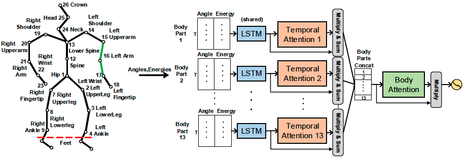

# BodyAttentionNetwork (BANet), ACIIW 2019
This is for the paper 'Learning Bodily and Temporal Attention in Protective Movement Behavior Detection', presented at ACIIW'19.

# Preparation
If you want to run the network on EmoPain dataset (http://www.emo-pain.ac.uk/), you need to extract the angle and energy data from it.
The EmoPain dataset will be soon released for a workshop at ACII 2019.
If you want to run the network on your dataset, please make sure you understand how the BANet works.

To use the model, the best way is to read the paper: 

Wang, Chongyang, Min Peng, Temitayo A. Olugbade, Nicholas D. Lane, Amanda C. De C. Williams, and Nadia Bianchi-Berthouze. "[Learning temporal and bodily attention in protective movement behavior detection](https://ieeexplore.ieee.org/abstract/document/8925084/)", In 2019 8th International Conference on Affective Computing and Intelligent Interaction Workshops and Demos (ACIIW), pp. 324-330. IEEE, 2019.

Then you can

i)  change the number of body parts/sensors to your need;

ii) tune the hyperparameter;

iii)use the AttentionScoreExtract.py + TemporalAttenHeatMap.py to analyze your result.

# Code Description
BANet.py is the proposed one with two attention mechanisms, namely bodily-attention and temporal-attention.

BANet-body.py is the variant of BANet only with bodily-attention.

BANet-time.py is the variant of BANet only with temporal-attention.

AttentionScoreExtract.py is used to load the model and obtain the output from specified layers.

TemporalAttenHeatMap.py is to create the heat map for your obtained temporal attention scores.

Within each code, instructions are also provided.

# Citation
Find it useful for your project?
Please also kindly refer to the following papers:

Wang, Chongyang, Min Peng, Temitayo A. Olugbade, Nicholas D. Lane, Amanda C. De C. Williams, and Nadia Bianchi-Berthouze. "[Learning temporal and bodily attention in protective movement behavior detection](https://ieeexplore.ieee.org/abstract/document/8925084/)", In 2019 8th International Conference on Affective Computing and Intelligent Interaction Workshops and Demos (ACIIW), pp. 324-330. IEEE, 2019.

Wang, Chongyang, Temitayo A. Olugbade, Akhil Mathur, Amanda C. De C. Williams, Nicholas D. Lane, and Nadia Bianchi-Berthouze. "[Recurrent network based automatic detection of chronic pain protective behavior using mocap and semg data](https://dl.acm.org/doi/abs/10.1145/3341163.3347728)", In Proceedings of the 23rd international symposium on wearable computers (ISWC), pp. 225-230. 2019.

